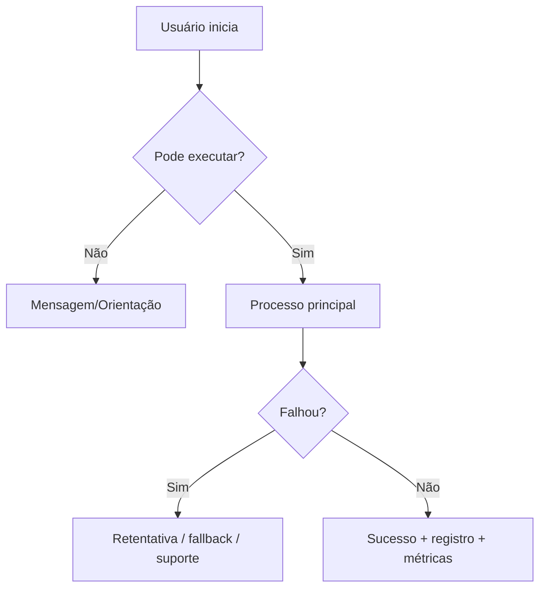
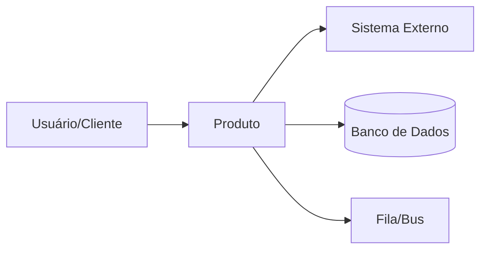
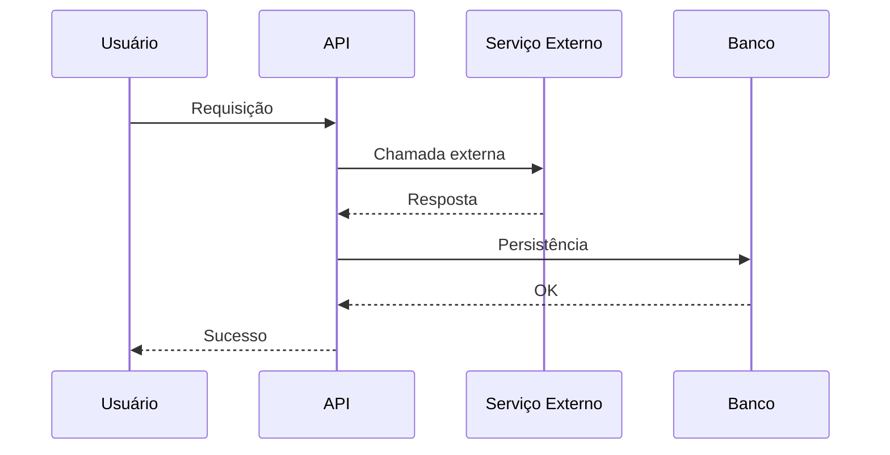
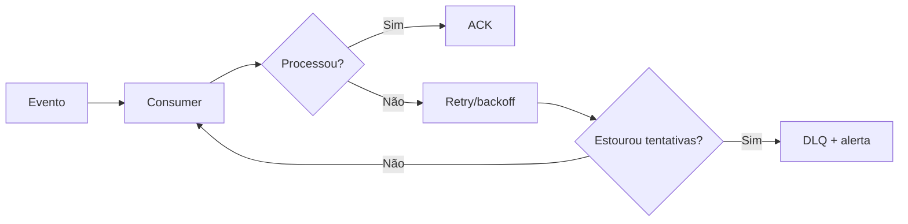

# Guia de Documentação Completa (Negócio + Tecnologia) para Squads que Fazem Build & Run

> **Objetivo**: um guia/“template mestre” para que qualquer pessoa (dev, arquiteto, infra, negócio ou IA) consiga produzir uma documentação **muito completa**, com **múltiplas visões** e **recursos visuais** (diagramas, fluxos, tabelas), servindo como “padrão de mercado” para produtos e áreas.

> **Premissa**: a documentação **já será publicada em MkDocs**. Aqui o foco é **o conteúdo** (o que documentar + como organizar + como apresentar visualmente), não configuração da ferramenta.

---

## 1) O que uma documentação “de mercado” precisa entregar

Uma documentação robusta funciona como **fonte única de verdade** do produto e precisa cobrir:

- **Por quê**: objetivos e contexto de negócio
- **O quê**: funcionalidades, regras e fluxos
- **Como**: arquitetura, integrações, dados, segurança
- **Como roda**: infra, deploy, observabilidade, incidentes
- **Como evolui**: decisões registradas, versões e mudanças
- **Como entrar**: onboarding e formas de contribuir
- **Como se ajudar**: FAQ e troubleshooting (autoatendimento)

---

## 2) Como organizar a documentação por “tipos” (Diátaxis)

Uma forma prática e escalável de manter docs claras é organizar por **quatro tipos** (necessidades diferentes do leitor):  
**Tutoriais**, **How-to (guias)**, **Referência** e **Explicação**. Isso evita misturar “passo a passo” com “conceito” e reduz confusão.

### 2.1 Mapa rápido (para usar como regra editorial)
| Tipo | Para quê serve | Tom | Exemplo |
|---|---|---|---|
| Tutorial | ensinar do zero | guiado, pedagógico | “Primeiro deploy do serviço” |
| How-to | resolver uma tarefa específica | objetivo | “Como rotacionar credencial X” |
| Referência | consulta precisa | formal, completo | “Config vars”, “Endpoints”, “Schemas” |
| Explicação | dar contexto/decisão | conceitual | “Por que usamos fila + DLQ” |

> Dica: ao criar páginas, escolha **um tipo** e não misture.

---

## 3) Estrutura do Portal do Produto

> Use este “esqueleto” em todas as squads/produtos. Ele é propositalmente modular para crescer sem virar bagunça.

### 3.1 Início (visão executiva)
**Conteúdo mínimo:**
- O que é o produto e o problema que resolve
- Para quem é (personas / usuários)
- O que está dentro e fora do escopo
- Links essenciais (board, canais, dashboards, pipelines, runbooks)
- Glossário (termos do negócio e termos técnicos)

**Tabela — resumo executivo**
| Item | Conteúdo |
|---|---|
| Objetivo | |
| Usuários | |
| Principais funcionalidades | |
| Dependências críticas | |
| Métricas de sucesso | |
| Contatos (dono negócio / tech / operação) | |

---

### 3.2 Visão de Negócio

#### 3.2.1 Produto e regras
- Regras de negócio (invariantes, validações, exceções)
- Políticas (ex.: prazos, limites, permissões)
- Cenários de sucesso e falha (com critérios claros)
- Roadmap / próximos passos (se fizer sentido no seu contexto)

#### 3.2.2 Fluxos e jornadas (visual)
- Fluxos ponta a ponta (happy path + exceções)
- Jornadas (as-is / to-be)
- Pontos de decisão (aprovação, fallback, retry, etc.)

**Exemplo (Mermaid) — fluxo de jornada**


#### 3.2.3 FAQ de negócio
- “Como pedir acesso?”
- “Como priorizamos?”
- “Como reportar problema?”
- “Qual impacto de uma indisponibilidade?”
- “O que é considerado ‘pronto’?”

---

### 3.3 Visão de Arquitetura (arc42 + C4)

> Uma combinação muito usada: **arc42** como estrutura de tópicos e **C4** como padrão de diagramas (do alto nível ao detalhe).  
> **Meta**: arquitetura compreensível para técnicos e também “traduzível” para não técnicos.

#### 3.3.1 Arquitetura em camadas de detalhe (C4)
- **Contexto**: o sistema no mundo (atores e sistemas vizinhos)
- **Containers**: principais aplicações/serviços, bancos, filas, etc.
- **Componentes**: módulos importantes dentro de um container
- (Opcional) **Código**: referência de pacotes/módulos e convenções

**Exemplo (Mermaid) — contexto**


#### 3.3.2 Documentação arquitetural “enxuta e completa” (arc42)
Para não esquecer tópicos críticos, use um checklist baseado em arc42:
- Objetivos e restrições
- Contexto e escopo
- Visão de solução (alto nível)
- Regras, conceitos e decisões
- Visões de runtime/deploy
- Riscos, qualidade e trade-offs

> Dica prática: transforme cada tópico em uma página e mantenha um “mínimo aceitável” obrigatório.

#### 3.3.3 Decisões registradas (ADR)
Registre decisões importantes como **ADR** (curto, objetivo, versionado):
- título, status, contexto, decisão, consequências

**Template ADR**
- **Título**
- **Status**: Proposto | Aceito | Depreciado | Substituído
- **Contexto**: forças, requisitos, restrições
- **Decisão**: o que foi escolhido
- **Consequências**: prós, contras, impactos
- **Links/Evidências**: issue, benchmark, POC

---

### 3.4 Visão Técnica (para dev e QA)

#### 3.4.1 Stack, padrões e convenções
- Linguagens, frameworks, libs, versões
- Padrões arquiteturais e de código
- Convenções de branch/commit, code review, lint, testes
- Como adicionar observabilidade (logs/metrics/traces) no padrão do time

**Tabela — stack**
| Camada | Tecnologia | Observações |
|---|---|---|
| Backend | | |
| Frontend | | |
| Banco | | |
| Mensageria | | |
| Observabilidade | | |

#### 3.4.2 Setup local (tutorial)
- Pré-requisitos (runtime, Docker, variáveis)
- “Rodar local em 10 minutos”
- Seeds/migrations
- Rodar testes, linters e quality gates

**Checklist**
- [ ] Clonar repo
- [ ] Configurar `.env` (com exemplos)
- [ ] Subir dependências (DB/queues/etc.)
- [ ] Aplicar migrations
- [ ] Rodar app
- [ ] Rodar testes

#### 3.4.3 APIs e contratos (referência)
- OpenAPI/Swagger (endpoints, auth, erros)
- Eventos/mensagens (schema, versionamento, compatibilidade)
- Idempotência, retries e DLQ
- Timeouts, limites e políticas de fallback

**Tabela — inventário de integrações**
| Integração | Tipo | Dono | Contrato | Autenticação | Retry/DLQ | Observações |
|---|---|---|---|---|---|---|
| Serviço A | HTTP | | | | | |
| Fila X | Evento | | | | | |

---

### 3.5 Dados (modelos, governança e operação)

- Modelo lógico (entidades e relacionamentos)
- Migrações e estratégia de versionamento do schema
- Estratégias de consulta/índices e hotspots
- Políticas de retenção, auditoria e LGPD (quando aplicável)
- Backups e restauração (runbook)

**Tabela — entidades críticas**
| Entidade | Descrição | Chaves/Índices | Volume | Sensibilidade |
|---|---|---|---|---|
| | | | | |

---

### 3.6 Operação (Build & Run)

#### 3.6.1 Ambientes
- Diferenças entre dev/hml/prod
- Feature flags, configurações e segredos
- Rotina de deploy e rollback (how-to)

#### 3.6.2 Observabilidade (referência + how-to)
- O que logar (com exemplos) e padrões de correlação
- Métricas essenciais por tipo de sistema (API/worker/job)
- Tracing (quando usar e como correlacionar)
- Dashboards recomendados (links)
- Alertas: sinais, thresholds, dono e ação

**Tabela — sinais essenciais**
| Sinal | O que medir | Exemplo | Onde ver | Alerta | Ação |
|---|---|---|---|---|---|
| Latência | p95/p99 | | | | |
| Erros | 4xx/5xx | | | | |
| Fila | lag/age | | | | |
| DB | conexões/slow | | | | |

#### 3.6.3 Runbooks e incidentes (how-to)
- Como detectar, mitigar e validar recuperação
- Procedimentos de comunicação (war room)
- Postmortem (aprendizado e ações)

**Template Runbook**
- **Sintoma**
- **Impacto**
- **Como detectar**
- **Possíveis causas**
- **Mitigação passo a passo**
- **Como validar recuperação**
- **Links úteis**

---

### 3.7 Onboarding (para novas pessoas)

#### 3.7.1 Como o time trabalha (explicação)
- Rituais e cadência
- Como prioriza e decide
- Qualidade mínima (“Definition of Done”)

#### 3.7.2 Acessos e responsabilidades (referência)
- Como pedir acesso e quem aprova
- Matriz de permissões
- Contatos e escalonamento

**Tabela — RACI**
| Atividade | Responsible | Accountable | Consulted | Informed |
|---|---|---|---|---|
| Deploy produção | | | | |
| Aprovar acessos | | | | |
| Postmortem | | | | |

---

## 4) Recursos visuais (padrões e exemplos)

### 4.1 Quais visuais usar e quando
- **C4 (Contexto/Containers/Componentes)**: arquitetura clara e escalável
- **Fluxogramas**: regras e decisões
- **Sequência**: integrações e etapas
- **Implantação**: rede, clusters e dependências
- **Mapas de dependências**: “quem chama quem”
- **Threat model (alto nível)**: riscos e controles

### 4.2 Exemplos prontos (Mermaid)

**Sequência (integração)**


**Retry e DLQ**


---

## 5) Boas práticas de qualidade e manutenção (docs vivas)

### 5.1 Docs-as-Code
- Documentação versionada e revisada como código (PR + review).
- Mudou contrato/fluxo/infra? **Atualiza doc junto**.
- Checklist na Definition of Done: “doc atualizada quando necessário”.

### 5.2 Consistência editorial
- Padrão de títulos e estrutura por página
- Padrão de exemplos e glossário
- “Notas/alertas” com padrão visual (para riscos operacionais)

### 5.3 Donos e revisões
- Donos por seção (arquitetura, operação, APIs)
- Revisão periódica de páginas críticas
- Canal de feedback (issues) para apontar doc quebrada/desatualizada

---

## 6) Template mestre para “copiar e preencher”

> Use como formulário para criar a documentação de um novo produto rapidamente.

### 6.1 Metadados
- **Nome do produto**:
- **Dono (negócio)**:
- **Dono (tech)**:
- **Canais**:
- **Links essenciais** (board, dashboards, pipelines, runbooks):
- **Ambientes**:

### 6.2 Negócio
- **Objetivo**:
- **Principais fluxos**:
- **Regras críticas**:
- **KPIs**:
- **FAQ de negócio**:

### 6.3 Arquitetura
- **Contexto (C4)**:
- **Containers (C4)**:
- **Componentes relevantes**:
- **Integrações**:
- **ADRs principais**:

### 6.4 Engenharia
- **Stack**:
- **Setup local**:
- **Testes e qualidade**:
- **API/Contratos**:
- **Padrões e convenções**:

### 6.5 Operação
- **Ambientes**:
- **Observabilidade**:
- **Alertas e SLOs**:
- **Runbooks**:
- **Procedimento de incidente**:

---

## 7) Referências (para enriquecer e padronizar)

> Links estão em bloco para você copiar/colar (ou virar link clicável no seu portal).

```text
Diátaxis (framework de documentação: tutorial, how-to, reference, explanation)
- https://diataxis.fr/
- https://diataxis.fr/start-here/

arc42 (template de documentação de arquitetura)
- https://arc42.org/
- https://arc42.org/overview
- https://arc42.org/documentation/

C4 Model (padrão de diagramas de arquitetura)
- https://c4model.com/
- https://c4model.info/

ADRs (Architecture Decision Records) e template do Nygard
- https://adr.github.io/
- https://adr.github.io/adr-templates/
- https://www.cognitect.com/blog/2011/11/15/documenting-architecture-decisions
```

---

## Observação final

Este guia foi estruturado para:
1) **cobrir negócio e tecnologia de ponta a ponta**,  
2) oferecer **múltiplas visões** (stakeholders, arquitetura, dev, operação),  
3) incentivar **uso de visuais**,  
4) manter a doc **viva e sustentável** com práticas reconhecidas (Diátaxis, arc42, C4, ADR).  
