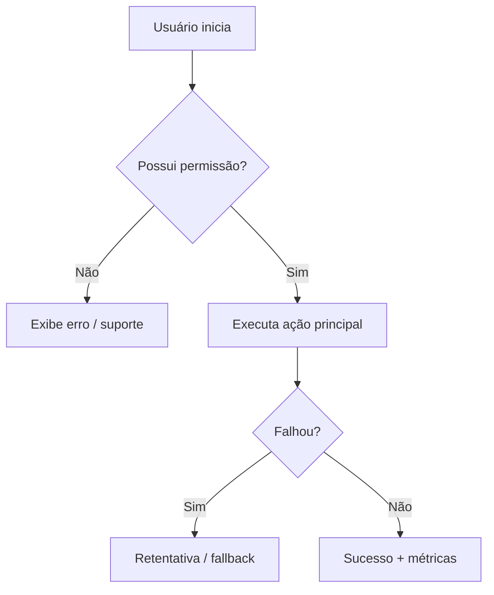
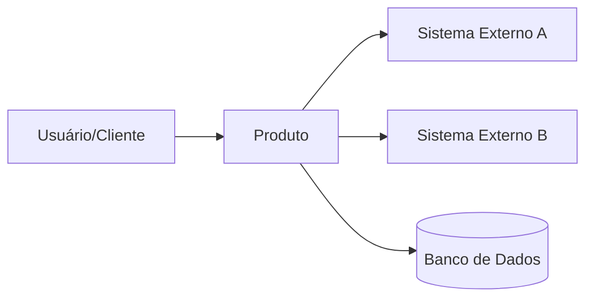
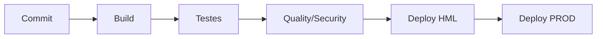
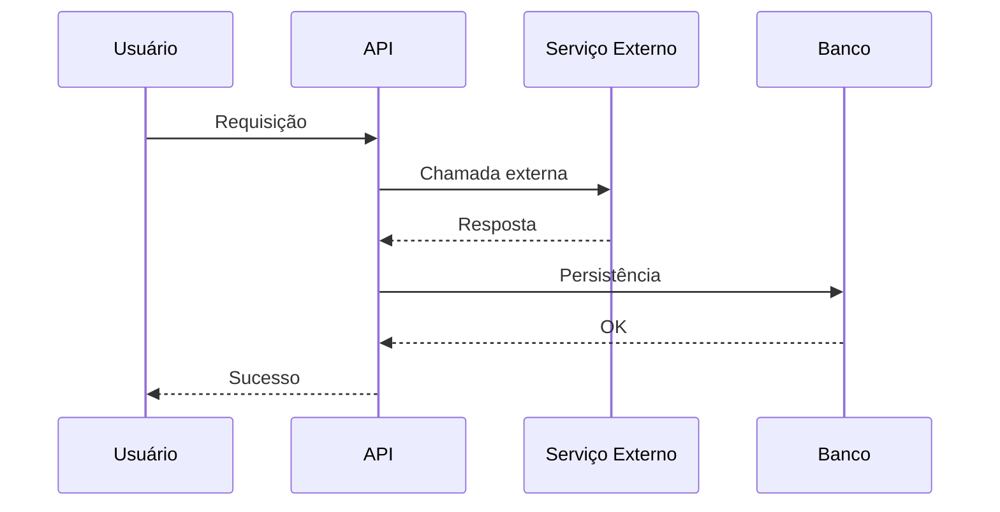
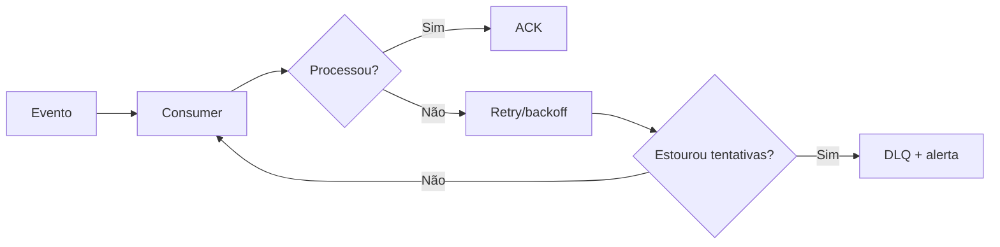

# Guia de Documentação Completa (Negócio + Tecnologia) para Squads que Fazem Build & Run (MkDocs)

> **Objetivo**: ter uma documentação **rica e reutilizável**, publicada em **MkDocs (GitHub Pages)**, com **várias visões** (negócio, arquitetura, infra, dev, operação) e com **recursos visuais** (diagramas, fluxos, tabelas, imagens).
>
> Este documento consolida **todo o conteúdo produzido** na síntese: estrutura do portal, melhores práticas (clareza, navegação, consistência, atualização), seções essenciais (negócio/arquitetura/infra/onboarding/FAQs), recursos visuais (C4/fluxos/seq/implantação) e escolha de ferramentas com foco em publicação estática — **fixando MkDocs como padrão**.

---

## 1) Princípios que guiam a documentação

### 1.1 Audiências (múltiplas visões)
Documentação “de mercado” atende públicos diferentes, cada um com profundidade distinta:

- **Negócio / Stakeholders**: visão do produto, objetivos, regras e fluxos, métricas, roadmap e FAQ.
- **Arquitetura**: contexto, boundaries, decisões e trade-offs, integrações e contratos.
- **Infra / SRE / Operação**: deploy, runtime, observabilidade, incidentes, capacidade, dependências e runbooks.
- **Dev / QA / Segurança**: setup local, padrões, testes, APIs, threat model, compliance.

> Boa prática: separar conteúdo por **visões** e oferecer navegação clara (menus laterais, sumário, breadcrumbs).

### 1.2 Clareza, navegabilidade e consistência
- Use **títulos descritivos** e páginas segmentadas.
- Prefira **passo a passo**, **checklists** e **tabelas** em vez de texto corrido.
- Defina um **guia de estilo** (tom, termos, padrões de exemplos, padrão de “nota/alerta”).
- Documentação é **viva**: atualize junto com releases, mudanças de contratos, migrações e runbooks.

### 1.3 “Mostrar” > “contar”
Sempre que possível, complemente texto com:
- **Diagramas** (arquitetura, sequência, implantação)
- **Fluxogramas** (processos e jornadas)
- **Tabelas** (configurações, matrizes, SLAs/SLOs)
- **Imagens/GIFs/Vídeos curtos** (tutorial e uso)

---

## 2) Estrutura recomendada do portal (por produto)

> Sugestão: cada produto/área replica esta estrutura em páginas do MkDocs.

### 2.1 Visão de Negócio

#### 2.1.1 Visão geral do produto
- O que é o produto e por que existe
- Problema que resolve e para quem (personas)
- Escopo (o que entra / o que não entra)
- Glossário de termos do negócio

**Tabela — resumo executivo**
| Item | Conteúdo |
|---|---|
| Objetivo | |
| Usuários | |
| Principais funcionalidades | |
| Principais riscos | |
| Métricas de sucesso | |

#### 2.1.2 Jornadas e fluxos (visual)
- Jornada do usuário (as-is / to-be)
- Regras de negócio críticas
- Fluxos ponta a ponta (incluindo exceções e erros)

**Exemplo (Mermaid) — fluxograma de jornada**


#### 2.1.3 FAQ de Negócio
- Perguntas recorrentes (escopo, prioridade, métricas, responsabilidades)
- “Como pedir X?”, “Como reportar bug?”, “Como solicitar acesso?”

---

### 2.2 Visão de Arquitetura (alto nível → detalhado)

#### 2.2.1 Contexto do sistema (alto nível)
- Quem usa
- Quais sistemas integra
- Qual o boundary do produto

**Exemplo (Mermaid) — contexto simplificado**


#### 2.2.2 Containers / componentes (detalhamento progressivo)
- Serviços, filas, jobs, workers, frontends
- Responsabilidades de cada parte
- Pontos críticos (latência, consistência, idempotência, retries)

**Tabela — inventário de componentes**
| Componente | Tipo | Responsabilidade | Dono | SLA/SLO | Observabilidade |
|---|---|---|---|---|---|
| API | Serviço | | | | |
| Worker | Consumidor | | | | |
| DB | Banco | | | | |

#### 2.2.3 Decisões de arquitetura (ADR)
Registre decisões importantes com contexto e trade-offs, evitando “conhecimento oral”.

**Template ADR**
- **Título**
- **Contexto**
- **Decisão**
- **Alternativas consideradas**
- **Consequências**
- **Links / evidências**

---

### 2.3 Visão Técnica (devs, QA, segurança)

#### 2.3.1 Stack e padrões
- Linguagem, framework, libs
- Padrões (DDD, Clean, hexagonal, etc.)
- Convenções: commits, branches, lint, testes, code review

**Tabela — stack**
| Camada | Tecnologia | Observações |
|---|---|---|
| Backend | | |
| Frontend | | |
| Banco | | |
| Mensageria | | |

#### 2.3.2 Setup local e execução
- Pré-requisitos (Docker, versões, envs)
- Como rodar local (make, scripts, comandos)
- Seeds/migrations
- Como rodar testes e linters

**Checklist**
- [ ] Clonar repo
- [ ] Configurar `.env`
- [ ] Subir dependências (docker compose)
- [ ] Rodar migrations
- [ ] Rodar aplicação
- [ ] Rodar testes

#### 2.3.3 API / contratos / integração
- OpenAPI/Swagger e/ou contratos de eventos
- Exemplos de requests/responses
- Schemas, versões, compatibilidade
- Códigos de erro + política de retry

**Tabela — eventos**
| Evento | Producer | Consumer | Schema | Retry | DLQ |
|---|---|---|---|---|---|
| evento.x | | | | | |

---

### 2.4 Infra, Deploy e Operação (Build & Run)

#### 2.4.1 Ambientes e topologia
- Dev / HML / Prod (o que muda)
- DNS, ingress, certificados
- Segredos e variáveis (onde ficam e como rotaciona)

#### 2.4.2 CI/CD
- Pipeline stages (build, test, scan, deploy)
- Artefatos gerados
- Rollback / hotfix
- Gestão de releases e versionamento

**Exemplo (Mermaid) — pipeline**


#### 2.4.3 Observabilidade
- Logs, métricas, tracing
- Dashboards e alertas
- SLIs/SLOs e error budget
- Como diagnosticar (links e runbooks)

**Tabela — observabilidade**
| Sinal | O que medir | Onde ver | Alerta | Dono |
|---|---|---|---|---|
| Latência | | | | |
| Erros | | | | |
| Fila | | | | |

#### 2.4.4 Runbooks e incidentes
- Procedimentos (war room e comunicação)
- Como coletar evidências (logs/metrics/traces)
- Mitigação e correção definitiva
- Postmortem e lições aprendidas

**Template Runbook**
- Sintoma
- Impacto
- Como detectar
- Possíveis causas
- Passo a passo de mitigação
- Como validar que voltou
- Links úteis

---

### 2.5 Onboarding (pessoas novas em dias, não semanas)

#### 2.5.1 Como a squad trabalha
- Rotina (rituais, cadência)
- Como prioriza (backlog, critérios)
- Definição de pronto / qualidade mínima

#### 2.5.2 Acessos e responsabilidades
- Quem aprova acessos
- Matriz de permissão
- Regras de segurança/compliance

**Tabela — matriz RACI**
| Atividade | Responsible | Accountable | Consulted | Informed |
|---|---|---|---|---|
| Deploy prod | | | | |
| Aprovar acesso | | | | |

---

## 3) Recursos visuais recomendados (arsenal)

### 3.1 Tipos de diagramas úteis
- **Contexto / containers / componentes** (visão progressiva)
- **Sequência**: integrações e passos do fluxo
- **Fluxograma**: regras e decisões
- **Implantação**: infra e rede
- **Mapa de dependências**: internos e externos
- **Threat model** (alto nível): riscos e controles

**Exemplo (Mermaid) — sequência**


### 3.2 Tabelas que “pagam dividendos”
- Inventário de componentes
- Matriz de integração
- SLIs/SLOs e alertas
- Matriz RACI
- Padrões de erro e retry
- Checklist de release

---

## 4) Boas práticas de manutenção (para não virar “doc morta”)

- **Docs-as-Code** (versionada junto do código).
- PRs de documentação com **review** como qualquer mudança.
- Checklist na “Definition of Done”: doc quando muda contrato/fluxo/infra.
- Revisões periódicas (mensal/trimestral) para páginas críticas.
- Donos claros por seção (sem virar dependência de uma pessoa só).
- Canal de feedback (issues/requests) para reportar doc desatualizada.

---

## 5) MkDocs como padrão (estrutura pronta)

### 5.1 Estrutura de pastas recomendada
```text
docs/
  index.md
  business/
    overview.md
    journeys.md
    faq.md
  architecture/
    context.md
    containers.md
    components.md
    adrs.md
  engineering/
    stack.md
    local-setup.md
    api-contracts.md
    testing.md
  operations/
    environments.md
    cicd.md
    observability.md
    runbooks.md
    incident-management.md
  onboarding/
    how-we-work.md
    access.md
    glossary.md
  appendices/
    templates.md
    diagrams.md
mkdocs.yml
```

### 5.2 `mkdocs.yml` (exemplo base)
> Ajuste nomes, links e plugins conforme sua realidade.

```yaml
site_name: "Docs do Produto"
site_description: "Documentação completa: negócio + arquitetura + engenharia + operação"
site_url: "https://<org>.github.io/<repo>/"

theme:
  name: material
  features:
    - navigation.tabs
    - navigation.sections
    - navigation.instant
    - toc.integrate
    - search.suggest
    - search.highlight

plugins:
  - search

markdown_extensions:
  - admonition
  - footnotes
  - tables
  - toc:
      permalink: true
  - pymdownx.superfences
  - pymdownx.details

nav:
  - Início: index.md
  - Negócio:
      - Visão geral: business/overview.md
      - Jornadas e fluxos: business/journeys.md
      - FAQ: business/faq.md
  - Arquitetura:
      - Contexto: architecture/context.md
      - Containers: architecture/containers.md
      - Componentes: architecture/components.md
      - ADRs: architecture/adrs.md
  - Engenharia:
      - Stack: engineering/stack.md
      - Setup local: engineering/local-setup.md
      - APIs & contratos: engineering/api-contracts.md
      - Testes: engineering/testing.md
  - Operação:
      - Ambientes: operations/environments.md
      - CI/CD: operations/cicd.md
      - Observabilidade: operations/observability.md
      - Runbooks: operations/runbooks.md
      - Incidentes: operations/incident-management.md
  - Onboarding:
      - Como trabalhamos: onboarding/how-we-work.md
      - Acessos: onboarding/access.md
      - Glossário: onboarding/glossary.md
  - Apêndices:
      - Templates: appendices/templates.md
      - Diagramas: appendices/diagrams.md
```

> **Dica prática**: padronize “admonitions” (notas/alertas) para informação operacional crítica.
Exemplo:

```md
!!! warning "Atenção"
    Esta ação impacta o ambiente de produção. Execute apenas seguindo o runbook.
```

---

## 6) Template reutilizável (copiar e preencher por produto)

### 6.1 Metadados
- **Nome do produto**:
- **Dono (negócio)**:
- **Dono (tech)**:
- **Repositório**:
- **Ambientes**:
- **Links (dashboards, pipelines, runbooks)**:

### 6.2 Visão de negócio
- **Objetivo**:
- **Principais fluxos**:
- **Regras críticas**:
- **KPIs/Sucesso**:
- **FAQ de negócio**:

### 6.3 Arquitetura
- **Diagrama de contexto**:
- **Diagrama de containers**:
- **Integrações**:
- **ADRs principais**:

### 6.4 Operação (build & run)
- **Como deploya**:
- **Como monitora**:
- **SLOs/Alertas**:
- **Runbooks**:
- **Procedimento de incidente**:

### 6.5 Desenvolvimento
- **Setup local**:
- **Como testar**:
- **Como contribuir**:
- **Padrões**:
- **API/Contratos**:

---

## 7) Apêndice: Snippets prontos (Mermaid)

### A) Fluxo com retry e DLQ


### B) Checklist de release
- [ ] Pipeline verde
- [ ] Migrações revisadas
- [ ] Feature flags definidas
- [ ] Dashboards e alertas ok
- [ ] Runbooks atualizados
- [ ] Release notes publicadas
- [ ] Plano de rollback testado

---

## 8) Próximos passos (para transformar em portal publicado)

1. Criar repo (ou pasta `/docs`) e colocar a estrutura sugerida.
2. Adotar o `mkdocs.yml` base e ajustar o `nav`.
3. Definir padrões: estilo, templates, responsáveis, política de atualização.
4. Migrar conteúdo existente (README, runbooks soltos, diagramas, links) para as páginas.
5. Publicar no GitHub Pages via pipeline (GitHub Actions) gerando e subindo o site.

---

### Observação final
Este arquivo é o **guia mestre**. Em uso real, você normalmente quebrará este conteúdo em múltiplas páginas do MkDocs (como sugerido na estrutura `docs/`), mantendo a navegação do portal limpa e escalável.
