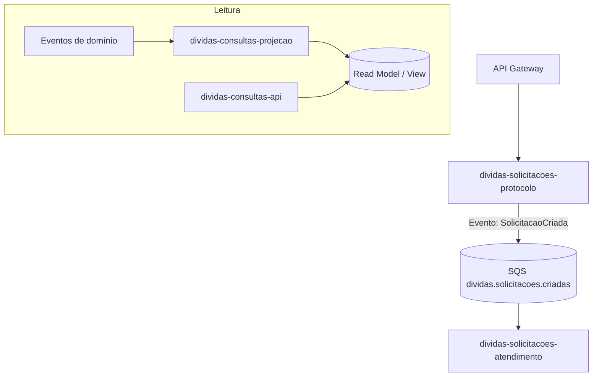

# Padrão Institucional de Nomenclatura e Perfis (Spring)  
**Aplicável aos serviços do domínio “Dívidas” e extensível aos demais domínios**

> **Proposta oficial de padronização** para a squad do Itaú, alinhada a DDD e CQRS, visando clareza semântica entre negócio e tecnologia, rastreabilidade operacional e consistência de código, infra e observabilidade.

---

## 1) Sumário executivo

Esta norma institucional define um **vocabulário único** e um **padrão de nomes e perfis** para serviços e módulos, adotando os termos de negócio **Protocolo**, **Atendimento**, **Consultas** e **Projeção**.  
Benefícios principais:

- **Clareza** entre áreas (negócio/tech/ops) — evita termos genéricos como “Processamento”.
- **Aderência a DDD/CQRS** — separa escrita (commands) e leitura (queries).
- **Operação e auditoria facilitadas** — logs, métricas e filas com semântica inequívoca.
- **Escalabilidade organizacional** — padrão repetível em novos contextos e domínios.

---

## 2) Escopo

- **Cobertura**: APIs REST, consumers SQS/Kafka, materializadores de leitura, schedulers e pipelines CI/CD relacionados.  
- **Não cobre**: regras de negócio específicas de cada domínio (tratadas nas camadas de caso de uso).

---

## 3) Vocabulário institucional (glossário)

| Termo        | Papel no sistema (visão de negócio) | Direção CQRS | Exemplos de artefatos |
|--------------|--------------------------------------|--------------|------------------------|
| **Protocolo** | Receber e **protocolar** solicitações (validar, persistir e emitir evento) | **Escrita** | Controladores REST, `CriarSolicitacaoUseCase`, Publicadores SQS |
| **Atendimento** | **Cumprir/atender** solicitações (consumir eventos e orquestrar ações) | **Escrita** | Listeners/Handlers SQS, `AtenderSolicitacaoUseCase` |
| **Consultas** | Expor **leitura** para o cliente/consumidor (APIs de GET) | **Leitura** | Controladores REST de consulta, Query Services |
| **Projeção** | **Materializar** o modelo de leitura (atualizar views/índices) | **Leitura** | Projectors/Event Handlers, Repositórios read |

> Observação: quando o “Atendimento” coordenar múltiplas etapas/serviços, o termo **Atendimento** continua válido institucionalmente (mantém linguagem de negócio). Se necessário tecnicamente, documentar internamente como “orquestração”.

---

## 4) Convenção de nomes

### 4.1. Regra base
**`<dominio>-<contexto>-<papel>`**

- **dominio**: nome do domínio de negócio (ex.: `dividas`)
- **contexto**: subdomínio/área (ex.: `solicitacoes`, `consultas`)
- **papel**: `protocolo`, `atendimento`, `api`, `projecao`, `scheduler` (quando existir)

### 4.2. Exemplos oficiais (domínio Dívidas)
- **Escrita / entrada (API)**: `dividas-solicitacoes-protocolo`
- **Escrita / consumo (worker)**: `dividas-solicitacoes-atendimento`
- **Leitura / APIs de consulta**: `dividas-consultas-api`
- **Leitura / materialização**: `dividas-consultas-projecao`

> O padrão é **bilateral** (back e ops): nomes de **repositórios**, **módulos**, **artefatos**, **imagens**, **deployments**, **filas** e **dashboards** devem refletir esta convenção.

---

## 5) Perfis Spring (configuração)

| Papel | `@Profile` | Tipos de beans predominantes | `spring.main.web-application-type` |
|------|-------------|------------------------------|-------------------------------------|
| Protocolo | `protocolo` | REST controllers, cases de escrita, publishers | `servlet` |
| Atendimento | `atendimento` | Listeners/handlers SQS/Kafka, cases de escrita | `NONE` |
| Consultas (API) | `consultas-api` | REST controllers de leitura, query services | `servlet` |
| Projeção | `consultas-projecao` | Projectors/event handlers, repos read | `NONE` |

**Arquivos de configuração**:
- `application-protocolo.yml`
- `application-atendimento.yml`
- `application-consultas-api.yml`
- `application-consultas-projecao.yml`

> **Prática recomendada**: separar as execuções em **módulos/serviços distintos** (um artefato por perfil crítico). Caso monorepo/monolito modular seja necessário, ativar perfis por ambiente com variáveis (`SPRING_PROFILES_ACTIVE`).

---

## 6) Estrutura de pacotes (Java)

```
br.com.itau.<dominio>.<contexto>.<papel>.<camada>
```

**Exemplos**:
- `br.com.itau.dividas.solicitacoes.protocolo.controller`
- `br.com.itau.dividas.solicitacoes.protocolo.usecase`
- `br.com.itau.dividas.solicitacoes.atendimento.listener`
- `br.com.itau.dividas.consultas.api.controller`
- `br.com.itau.dividas.consultas.projecao.projector`

> **Camadas** (sugestão): `controller`, `usecase`, `domain`, `repository`, `publisher`, `listener`, `projector`, `config`.

---

## 7) Eventos, filas e DLQ (SQS/Kafka)

### 7.1. Padrão de nomes
- **Eventos**: `SolicitacaoCriada`, `SolicitacaoAtualizada`, `SolicitacaoAtendida`
- **Filas/Tópicos**: `dividas.solicitacoes.criadas`, `dividas.solicitacoes.criadas-dlq`
- **Projeção** (separada, opcional): `dividas.solicitacoes.eventos`

> **Regra**: o **nome de fila/tópico** deve indicar **domínio.contexto.evento**; DLQs devem usar o sufixo `-dlq`.

---

## 8) Modelos de código (excertos)

```java
// API de escrita (Protocolo)
@Profile("protocolo")
@RestController
@RequestMapping("/solicitacoes")
class CriarSolicitacaoController {
    private final CriarSolicitacaoUseCase useCase;
    @PostMapping
    ResponseEntity<?> criar(@RequestBody CriarSolicitacaoCommand cmd) {
        var id = useCase.executar(cmd); // valida, persiste, publica evento
        return ResponseEntity.accepted().body(Map.of("id", id));
    }
}
```

```java
// Worker de escrita (Atendimento)
@Profile("atendimento")
@Component
class SolicitacaoCriadaListener {
    @SqsListener("${sqs.queues.dividas-solicitacoes-criadas}")
    void onMessage(SolicitacaoCriadaEvent event) {
        // cumprir/atender a solicitação
    }
}
```

```java
// API de leitura (Consultas)
@Profile("consultas-api")
@RestController
@RequestMapping("/consultas")
class ConsultarSolicitacaoController {
    @GetMapping("/{id}")
    ResponseEntity<?> porId(@PathVariable String id) {
        // lê modelo materializado
        return ResponseEntity.ok(/* view */);
    }
}
```

```java
// Projeção (materialização)
@Profile("consultas-projecao")
@Component
class SolicitacaoEventsProjector {
    void apply(SolicitacaoCriadaEvent e) {
        // atualiza read model (Dynamo/GSI/Elastic)
    }
}
```

---

## 9) Observabilidade e operação

- **Logs**: prefixar `dominio=contexto-papel` (ex.: `dividas=solicitacoes-protocolo`).
- **Métricas**: `counter.dividas.solicitacoes.protocolo.requests_total`, `timer.dividas.solicitacoes.atendimento.handle_ms`.
- **Tracing**: tags `dominio`, `contexto`, `papel`, `evento`.
- **Dashboards**: 1 pasta por domínio; 1 dashboard por papel.

---

## 10) Governança e versionamento

- **Repositórios**: `dividas-solicitacoes-protocolo`, `dividas-solicitacoes-atendimento`, `dividas-consultas-api`, `dividas-consultas-projecao`.
- **Branches**: `main` (prod), `next`/`develop` (staging).
- **Releases**: Semantic Release (ou equivalente corporativo), changelog com escopo igual ao nome do módulo.
- **Pipelines**: stages separados por papel; scans e testes coerentes com o perfil ativo.

---

## 11) Critérios de aceite (Definition of Done)

1. Nomes de **repo/módulo/artefato** seguem `<dominio>-<contexto>-<papel>`.
2. Perfis Spring e arquivos `application-*.yml` estão **alinhados** à tabela da Seção 5.
3. **Filas/tópicos e DLQs** seguem o padrão da Seção 7 (comprovado via IaC).
4. **Pacotes Java** obedecem à Seção 6.
5. **Logs/Métricas/Tracing** incluem `dominio`, `contexto`, `papel`.
6. Documentação do serviço contém **glossário** e **diagramas** com estes termos.
7. PR aprovado por **negócio** (vocabulário) e **arquitetura** (aderência).

---

## 12) Plano de adoção (curto prazo)

- **S1 — Oficializar vocabulário**: publicar esta norma no repositório de padrões.
- **S2 — Renomear artefatos** novos e **bloquear** termos genéricos (“Processamento”).
- **S3 — Ajustar pipelines/infra** para refletir perfis e nomes de imagens/filas.
- **S4 — Observabilidade**: alinhar dashboards, métricas e alertas.
- **S5 — Revisar serviços existentes** (renomeação incremental quando aplicável).

---

## 13) Perguntas frequentes (FAQ)

- **“Por que não usar ‘Processamento’?”**  
  É ambíguo (escrita ou leitura?), dificulta operação e auditoria e não conversa com o negócio.

- **“E se o worker fizer muitas etapas?”**  
  Continua sendo **Atendimento** (vocabulário de negócio). Documentar tecnicamente a orquestração no ADR do serviço.

- **“Posso usar inglês?”**  
  Institucionalmente preferimos PT-BR. Em contextos internacionais, mapear 1:1:  
  *Protocolo → Intake*, *Atendimento → Fulfillment*, *Consultas → Query*, *Projeção → Projection*.

---

## 14) Anexo A — Diagrama (alto nível, CQRS)



---

## 15) Anexo B — Modelo de variáveis (exemplo)

```properties
# Protocolo
SPRING_PROFILES_ACTIVE=protocolo
SQS_QUEUE_SOLICITACOES_CRIADAS=dividas.solicitacoes.criadas

# Atendimento
SPRING_PROFILES_ACTIVE=atendimento
SQS_QUEUE_CONSUMER=dividas.solicitacoes.criadas

# Consultas API
SPRING_PROFILES_ACTIVE=consultas-api

# Projeção
SPRING_PROFILES_ACTIVE=consultas-projecao
```
